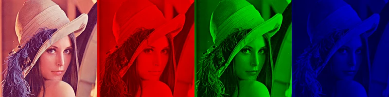
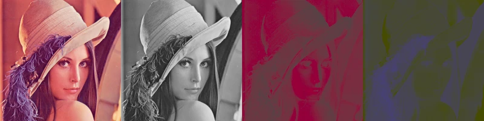

# image-decompose

The tool decomposes an RGB image into it’s channels in different
colour spaces.  sRGB (including linear RGB), HSL, HSV, HBW, XYZ, xyY,
L\*a\*b\*, LChab, L\*u\*v\*, LCHuv, CMY and CMYK
models are supported.

For each of those the program will load input image as an sRGB image,
convert it to given colour space and then create an image which
includes coordinates

# Example

An example image is included in `data` directory which can be used to
test the program:

    cargo run -- -f --resize 256x256 --crop 200x200+28+28 \
                 -o out data/lenna.png

As a result, the tool generates handful of WebP images and saves them
in the `out` directory with names matching `lenna-*.webp` pattern.
Each of the image includes decomposition of the source image into
separate channels in given colour space.

For example:

## sRGB

Perhaps the most familiar decomposition showing how much red, green
and blue is in each pixel of the image.  RGB model is additive thus
the result comes from adding all those colours.

## HSL

HSL attempts to be more user friendly by introducing more natural hue,
saturation and lightness controls.  The model isn’t perceptually
uniform though so changing only hue affects luminosity of the colour.

The image being quite uniform in hue of the colour leaves hue channel
to have comparatively little variance leaving just the blue feather to
pop.

## L\*u\*v\* and LChuv

L\*u\*v\* colour space tries to be perceptually uniform.  The
decomposition demonstrates the L\* channel corresponds to luminosity
while u\* and v\* coordinates fall on the green-red and blue-yellow
axes.

The L\*C\*h model makes the model easier to interpret by representing
chromaticity with more familiar hue and chroma values.

## CMY and CMYK

CMY and CMYK colour models are subtractive.  This is demonstrated by
the channels being ‘inverses’ of the image.  The less cyan the image
has, the higher value in the cyan channel.  Similarly for other
channels.

Addition of black channel means that the more black is used the less
of all the other channels is used (which is useful in printing of
course).
